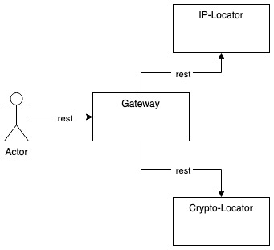

# Install Micro-Crypto-Finder via Helm

This repo contains all required information to fully install `Micro-Crypto-Finder` on a local Kubernetes environment.

## Requirements

1. Install Kubernetes via Docker Desktop
2. Activate Kubernetes on Docker Desktop
3. Install `kubectl` and `helm`
4. `kubectl config use-context docker-desktop`
5. `kubectl config current-context`

To check information related to the host:

1. `kubectl cluster-info`
2. `kubectl get nodes`

### Install Ingress (NGINX)

1. Install using `helm upgrade --install ingress-nginx ingress-nginx \
    --repo https://kubernetes.github.io/ingress-nginx \
    --namespace ingress-nginx \
    --create-namespace`
2. Check installation via `kubectl -n ingress-nginx get services -o wide -w ingress-nginx-controller`

For more info click [here](https://kubernetes.github.io/ingress-nginx/deploy/#quick-start) and [here](https://kubernetes.github.io/ingress-nginx/user-guide/basic-usage/).

## Services

### IP Locator

Given an IP, the relative `currency` is going to be returned.

Example: `GET /api/ip-locator/currency/111.111.111.111` returns `JPY`.

## Accessing the APIs

There are multiple ways to access our APIs. The provided helm-charts are configuring `NGINX Ingress` to allow external access using DNS routing, but Kubernetes also gives us a couple of other options without Ingress:

### Exposing endpoint via `kubectl proxy`

1. Run `kubectl proxy`
2. Access: `http://localhost:8001/api/v1/namespaces/<NAMESPACE>/services/<http or https>:<SVC NAME:<SVC PORT>/proxy/<TARGET SVC URL>`
3. Example: `curl http://localhost:8001/api/v1/namespaces/default/services/http:iplocator-microcryptofinder-iplocator:80/proxy/api/ip-locator/currency/111.111.111.111`

### Expose port via NodePort

1. `k expose pod iplocator-microcryptofinder-iplocator-577c77b997-h2xvk --type=NodePort`
2. `kubectl get svc` and check for type `NodePort`, get the port (example 32199)
3. `curl http://localhost:32199/api/ip-locator/currency/111.111.111.111`

### Expose port via `kubectl port-forward`

1. Via `port-forward`:
2. `kubectl port-forward iplocator-microcryptofinder-iplocator-577c77b997-h2xvk 3000:8080`
3. `curl http://localhost:3000/api/ip-locator/currency/111.111.111.111`
